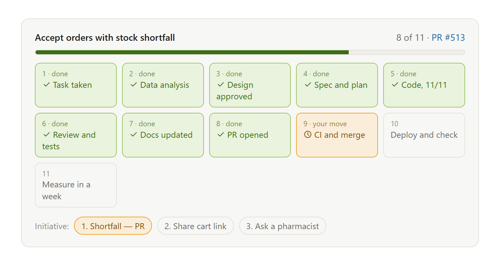
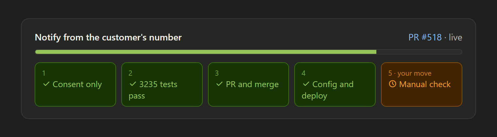

# stage-bar — see where your Claude Code task is, at a glance

[Русская версия](README.ru.md)

Long agentic tasks get lost in walls of text: what is done, what is happening now, and —
most importantly — **is anything waiting on you?** `stage-bar` is a Claude Code skill that
puts a stage card at the top of every progress reply on a development task.





- **Green** — done and verified (tests passed, review approved, PR actually opened).
- **Amber** — the current stage. When the next move is yours (approve the design, merge
  the PR, run the deploy), it says **«your move»**.
- **Grey** — still ahead.
- Big initiatives get a row of sub-project pills under the stages.

In the Claude desktop app (Code tab) it is an inline card. In the terminal, where there is
no widget tool, Claude prints the same thing as one line:

```
Checkout refactor · 8/11 · PR #513
✓ Taken → ✓ Analysis → ✓ Design → ✓ Spec+plan → ✓ Code 11/11 → ✓ Review → ✓ Docs → ✓ PR
→ ● CI and merge (your move) → ○ Deploy → ○ Measure
```

## Install

### As a plugin (recommended)

In Claude Code:

```
/plugin marketplace add zhaqekzkz/claude-stage-bar
/plugin install stage-bar@stage-bar
```

The skill is available in every project. Update with `/plugin marketplace update stage-bar`.

### Manually, as a folder

Copy `skills/stage-bar` into your user skills folder:

- macOS / Linux / WSL: `~/.claude/skills/stage-bar/`
- Windows: `C:\Users\<you>\.claude\skills\stage-bar\`

```bash
git clone https://github.com/zhaqekzkz/claude-stage-bar.git
cp -r claude-stage-bar/skills/stage-bar ~/.claude/skills/
```

### For one project (shared with your team)

Put the folder in `<project>/.claude/skills/stage-bar/` and commit it — everyone who opens
the repo in Claude Code gets the bar.

## Make it stick

Claude picks the skill up on its own when a task has several stages. To make sure it never
forgets, add one line to `~/.claude/CLAUDE.md` (all projects) or the project's `CLAUDE.md`:

```markdown
- Show the stage bar (stage-bar skill) in progress replies on development tasks.
```

## Customize the stages

The default pipeline lives in `skills/stage-bar/SKILL.md`, section «Stages»: taken →
analysis → design approved → spec and plan → code N/M → review and tests → docs → PR →
CI and merge → deploy → measure. Rename, drop or add your own (e.g. «Legal review»,
«App Store release») — Claude adapts the list to each task but keeps this order.

## Notes

- No buttons on purpose: buttons inside widgets don't work in Claude Code. Claude writes the
  next-step options as plain text under the bar.
- The card needs a widget tool (`show_widget`, available in the desktop app). Without it you
  get the text line.
- Labels follow the language you talk to Claude in.

License: MIT
