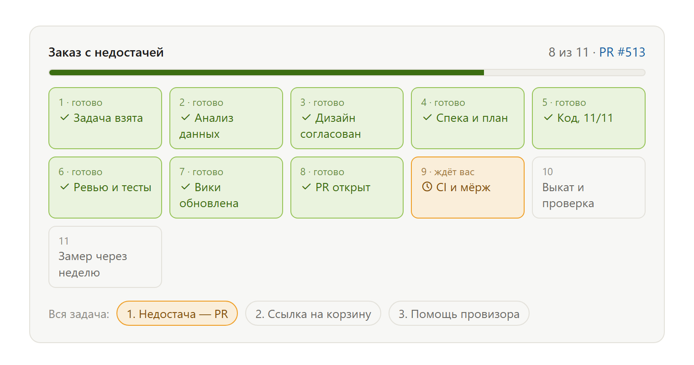
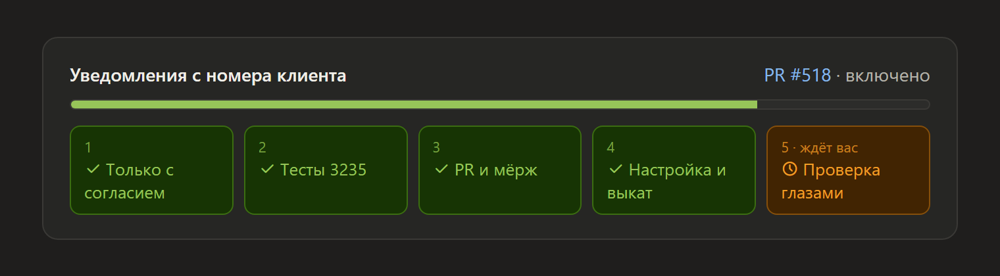

# stage-bar — плашка этапов для Claude Code

[English](README.md)

Длинные задачи с агентом теряются в тексте: что уже сделано, что сейчас и — главное —
**ждёт ли что-то от тебя**. `stage-bar` — навык (skill) для Claude Code: в каждом ответе
по задаче Claude показывает карточку этапов.





- **Зелёные** — готово и проверено (тесты прошли, ревью принято, PR правда открыт).
- **Жёлтый** — текущий этап. Если следующий шаг за тобой (одобрить дизайн, слить PR,
  запустить выкат), он подписан **«ждёт вас»**.
- **Серые** — впереди.
- Если задача разбита на подпроекты — под этапами строка подпроектов.

В десктоп-приложении (вкладка Code) это карточка прямо в чате. В терминале, где виджетов
нет, — та же полоска текстом:

```
Заказ с недостачей · 8/11 · PR #513
✓ Взята → ✓ Анализ → ✓ Дизайн → ✓ Спека+план → ✓ Код 11/11 → ✓ Ревью → ✓ Вики → ✓ PR
→ ● CI и мёрж (ждёт вас) → ○ Выкат → ○ Замер
```

## Установка

### Плагином (рекомендуется)

В Claude Code:

```
/plugin marketplace add zhaqekzkz/claude-stage-bar
/plugin install stage-bar@stage-bar
```

Навык подключится во всех проектах. Обновление — `/plugin marketplace update stage-bar`.

### Вручную, одной папкой

Скопируй `skills/stage-bar` в папку навыков пользователя:

- macOS / Linux / WSL: `~/.claude/skills/stage-bar/`
- Windows: `C:\Users\<имя>\.claude\skills\stage-bar\`

```bash
git clone https://github.com/zhaqekzkz/claude-stage-bar.git
cp -r claude-stage-bar/skills/stage-bar ~/.claude/skills/
```

### Только в одном проекте

Положи папку в `<проект>/.claude/skills/stage-bar/` и закоммить — плашка появится у всех,
кто работает с этим репозиторием через Claude Code.

## Чтобы плашка была всегда

Навык включается сам, когда задача многоэтапная. Чтобы Claude не забывал, добавь строку в
`~/.claude/CLAUDE.md` (глобально) или в `CLAUDE.md` проекта:

```markdown
- В ответах по задачам разработки показывай плашку этапов (навык stage-bar).
```

## Настройка этапов

Список — в `skills/stage-bar/SKILL.md`, раздел «Stages»: взята → анализ → дизайн → спека и
план → код N/M → ревью и тесты → документация → PR → CI и мёрж → выкат → замер.
Переименуй, убери или добавь свои (например, «Согласование с юристом» или «Публикация в
стор») — Claude подстраивает список под задачу, но порядок берёт отсюда.

## Ограничения

- Кнопок нет специально: в Claude Code кнопки в виджетах не работают. Варианты следующего
  шага Claude пишет текстом под плашкой.
- Карточке нужен инструмент `show_widget` (есть в десктоп-приложении). Без него — текстовая
  полоска.
- Подписи — на языке, на котором ты общаешься с Claude.

Лицензия: MIT
